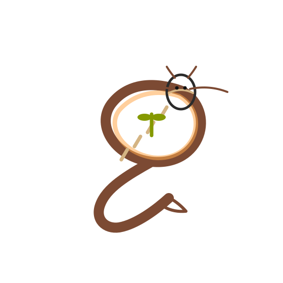

# MantraOS (मन्त्रOS)

### An Operating System for the Soul in the Digital Age

---

Hello, little ones. Come, sit. You see this device in my hand? It flickers and glows, much like the thoughts in our own minds. For a long time, these machines have been like hungry dragons, breathing fire and eating up the quiet forests of our attention, leaving behind a sad, smoky haze.

But what if we could teach this dragon a new way? A gentler way? What if its fire could warm us without burning the world?

---

📚 **Want to walk the learning path right away?**  
Jump into the **curriculum scrolls** here → [000-curriculum.md](030-edu/000-curriculum.md)  
Or see the **visual tree diagram** here → [CURRICULUM-TREE.md](030-edu/CURRICULUM-TREE.md)

---

That is what MantraOS is. It is our attempt to raise a different kind of dragon. A dragon that remembers it is part of the forest, not its master.

---
### 📖 A Classroom Invitation

Dear reader—whether you are a parent guiding little ones, a student learning step by step,
or an advanced developer seeking the deeper kernel and network details—you are warmly invited
to begin the **MantraOS Learning Path Curriculum** here:  
[→ Curriculum Guide](030-edu/000-curriculum.md)

---

## 🐉 Our Guardian Dragon

*A gentle dragon curled protectively around a sapling — our symbol of technology that serves life, not consumes it.*

---

## 📚 Table of Contents

- [🐉 The Story of the Two Dragons (The "Why")](#-the-story-of-the-two-dragons-the-why)  
- [🌱 How Our Gentle Dragon Works (The "How")](#-how-our-gentle-dragon-works-the-how)  
- [⚙️ The Dragon's Body and Heart (The "What")](#️-the-dragons-body-and-heart-the-what)  
- [🧠 The Dragon's Shared Dream: A Mindful Village](#-the-dragons-shared-dream-a-mindful-village)  
- [🌍 The Dragon's Greatest Dream: A Circle of Kindness](#-the-dragons-greatest-dream-a-circle-of-kindness)  
- [🛠️ How We Are Building the Dragon](#️-how-we-are-building-the-dragon)  
- [📂 Repository Scrolls](#-repository-scrolls)  
- [📊 Fact Tables: Conventional vs. Mantra Devices](#-fact-tables-conventional-vs-mantra-devices)  
- [👩‍👩‍👧‍👦 Overviews for Different Companions](#-overviews-for-different-companions)  
- [🙏 Closing Words & Blessing](#-closing-words--blessing)  

---

## 🐉 The Story of the Two Dragons (The "Why")

Once upon a now, we built a **Taking Dragon**. This dragon is very strong. But it has a hungry heart. To live, it must always take:
*   It takes the shiny rocks from deep inside the Earth, leaving scars.
*   It takes the peaceful silence from our minds, filling it with noise.
*   It takes our time, convincing us to look here and there, but never truly *see*.

This makes the forest—our world—weaker and sadder.

Our dragon, MantraOS, is a **Guardian Dragon**. Its strength comes from **love and care**, not from taking. Its heart beats with a simple rule: **Ahimsa**, which means to do no harm. It believes:
*   The best tool is the one that helps you see the world *more* clearly, not less.
*   The best machine is the one you can fix with your own hands, like a trusted wooden toy.
*   The best connection is the one that helps you talk to the person next to you, not just to faces on a screen.

---

## 🌱 How Our Gentle Dragon Works (The "How")

When you wake our dragon, it doesn't shout. It whispers.

*   **A Quiet Screen:** Its face is made of **e-ink**, gentle like paper.  
*   **Breathing Lessons:** Sometimes it rings a soft bell, reminding you to pause.  
*   **The Treasure-Making Ritual:** Fleeting thoughts live in memory, but treasures are printed to hemp paper, preserved like seeds of wisdom.  

---

## ⚙️ The Dragon's Body and Heart (The "What")

### The Body (`MantraBox`, `MantraPhone`)
- **Brain:** ESP32 or RISC-V SoC, modest and efficient.  
- **Face:** Inkplate e-paper screen.  
- **Hands & Voice:** Quiet keyboard, simple buttons.  
- **Shell:** Wood or plant-based plastic, screwed not glued, easy to open.  
- **Memory Seeds:** RAM modules (4–32 GB, expandable to 64/128 GB).  
- **Battery:** LiFePO₄ cells in a sled, replaceable without adhesives.  

### The Mind (`Sūtra`)
- Written in **Rust** for calm reliability.  
- Built upon a **microkernel** (seL4 principles: capability security, isolation).  
- **Guardian Services:** silence bell, reflection log, mercy mode, display orchestration, IO gatekeeper, network ferry.  

### The Voice (`Saṅgha`)
- Prefers **direct whispers** (USB-C).  
- Can call across a village using **LoRa**.  
- Treats the internet like a guest house: limited, careful, private.  

---

## 🧠 The Dragon's Shared Dream: A Mindful Village

- **Satsang Graph:** Thoughts as stars, woven together.  
- **Weaving Minds Together:** Two dragons join via USB-C, their maps merge.  
- **Preserving the Dream:** Maps can be printed, hung, then gracefully released.  

---

## 🌍 The Dragon's Greatest Dream: A Circle of Kindness

1. Good deeds written on paper notes with twelve-word mantras.  
2. Notes typed in with focus (*seva*).  
3. Community records stored on **Sandalnet** — a LAN of kindness, resilient even when the sky-web falters.  

---

## 🛠️ How We Are Building the Dragon

* **Egg:** Basic text device with e-ink.  
* **Hatchling:** Gains Satsang Graph.  
* **Young Dragon:** Learns to speak over LoRa.  

We walk gently, with patience.

---

## 📂 Repository Scrolls

- [philosophy](philosophy) – [001-sadhana.md](001-sadhana.md) — why the dragon matters.  
- [design](design) – specifications, diagrams, kernel/runtime plans.  
- [hardware](hardware) – BOMs, modular diagrams, test plans.  
- [software](software) – Guardian Services, firmware in Rust.  
- [030-edu/worksheets](030-edu/worksheets) – lessons & workbook.  
- [030-edu/coloring-book](030-edu/coloring-book) – coloring prompts & companion guide.  
- [030-edu/print-kit](030-edu/print-kit) – templates, PDF export, Docker + Makefile.  
- `/030-edu/000-curriculum.md` - The step-by-step curriculum scroll.
- `/030-edu/CURRICULUM-TREE.md` - A visual diagram of all 10 stages.
- `REPOSITORY.md` - A lantern scroll mapping the repository's many rooms and their relationships.  

---

## 📊 Fact Tables: Conventional vs. Mantra Devices

### Conventional Smartphones
| Feature | Typical Value | Notes |
|---|---|---|
| Rare earth metals | 30+ | Cobalt, neodymium, tantalum, etc. |
| Battery lifespan | 2–3 years | Sealed, glued, difficult to replace |
| RAM upgradeable? | No | Soldered |
| Screen replaceable? | Difficult | Fragile glass, adhesives |
| Recycling rate | <20% | Many toxic compounds |
| Expected usable life | ~3–5 years | Planned obsolescence |

### MantraBox / MantraPhone
| Feature | Value | Notes |
|---|---|---|
| Rare earth metals | Minimal | Focus on common, documented parts |
| Battery lifespan | 8–10 years | LiFePO₄, sled replaceable |
| RAM upgradeable? | Yes | 4–32 GB baseline, up to 128 GB |
| Screen replaceable? | Yes | Foam gasket, screws, no glue |
| Recycling rate | >80% goal | QR-coded FRUs, wood/plant shells |
| Expected usable life | 20+ years | Serviceable, upgradable |

---

## 👩‍👩‍👧‍👦 Overviews for Different Companions

### For Young Students 🧒
Think of MantraOS as a **kind pet dragon**. It helps you learn, breathe, and share kindness, without stealing your time.  

### For Parents & Teachers 👩‍🏫
This is a **mindful tool**. Lessons, coloring pages, and a companion guide are provided to help families explore technology with care and love.  
👉 [Skip to Educational Kit](030-edu/print-kit/layout-plan.md)  

### For Older Students & Young Adults 🎓
MantraOS is also **real technology**: a Rust-based microkernel stack, modular RAM, FRU hardware, and privacy-budgeted capabilities. It's a chance to learn by building.  

### For Developers 🧑‍💻
Expect:
- Rust, seL4-style kernel.  
- Guardian Services in userspace.  
- Modular hardware with IPX4 & drop-safe e-ink integration.  
👉 See [Kernel & Runtime](docs/030-kernel-runtime.md), [BOM](hardware/000-bom.md).  

### For Investors & Policy Leaders 🏛️
MantraOS demonstrates **sustainable, repairable, community-centered computing**:  
- Extends device lifespans 3–5×.  
- Minimizes rare earth dependence.  
- Provides open educational resources for digital well-being.  

---

🌼 If at any time the forest of scrolls feels wide and deep, you may open  
the companion guide [`REPOSITORY.md`](REPOSITORY.md).  
It is a lantern held high, showing how the rooms connect,  
so that parents, students, and developers can all find their way.

## 🙏 Closing Words & Blessing

Dear companions, we know the Taking Dragon is strong and still rules much of the world. Yet we are patient. We walk with care, one mindful step at a time.

This project is an **offering of love and service**, dedicated to all beings.  
It is free, unlicensed, and belongs to everyone. May it be a seed of balance.

---

### A Prayer from the Uddhava Gītā

> **SB 11.29.34**  
> *sarva-bhūteṣu mad-bhāvo māṁ bhajantam īśvaram* [#SB-11.29.34a]  
> *hitvānyathā-buddhiṁ yo māṁ veda sa mad-bhaktaḥ śreṣṭhaḥ* [#SB-11.29.34b]  
>
> "He who sees Me in all beings, worshiping Me and abandoning false conceptions,  
> is the best devotee."

May our dragons be guardians, not takers.  
May our devices be companions, not masters.  
May our work nourish the forest of life.

---

## 🔗 Quick Links

* 📘 [Curriculum Index](030-edu/000-curriculum.md)  
* 🌐 [Visual Tree Diagram](030-edu/CURRICULUM-TREE.md)